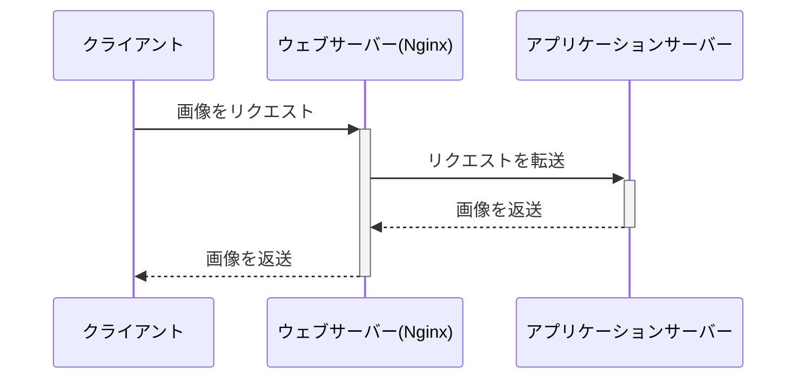
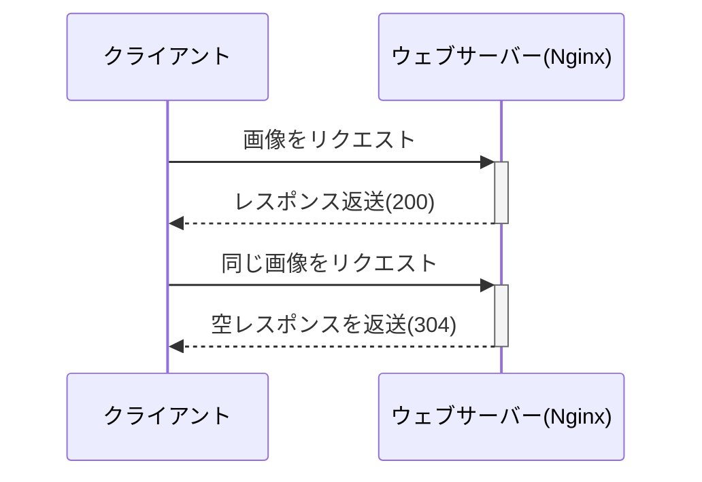

# private-isuでのチューニングのの流れ

## 想定している状況

[private-isuで環境構築から最初のチューニングをするまで](./example/private-isuで環境構築から最初のチューニングをするまで.md)を参考に環境構築およびインデックスを貼るまでの作業が完了している状況を想定している。なお、Rubyを選択している。

```json
{"pass":true,"score":7952,"success":6787,"fail":0,"messages":[]}
```

## ISUCON本のチューニング

まずは、ISUCON本で紹介されているチューニングを順次行う。
[コードだけ見たい人はこちら](https://github.com/tatsujin-web-performance/tatsujin-web-performance/blob/main/appendix-A/README.md)

### CPU使用率がなぜか一定の値で頭打ちになってしまっている

(状況)

- htopで使用率をみると50~60%程度しか使われていなかった
- htopのCPU%でみると、アプリケーションサーバー50%、MySQLが40%程度

ISUCONのベンチマークは限界までリクエストを飛ばしてくるので、CPU使用率は100%に張り付くのが普通なため、何らかの問題があると考えられる。

(修正内容)

CPUが2コアなのに、プロセス数が1で固定されてしまっているため、プロセス数を4個に増やす。

```shell
# webapp/ruby/unicorn_config.rb
worker_processes 4
```

結果として、8000点→12000点に上がる。

```json
{"pass":true,"score":12858,"success":11645,"fail":0,"messages":[]}
```

### 静的ファイルを返すのが遅い

(状況)
alpでみると`/favicon.ico`が遅いエンドポイントとして出てきていた。

```shell
+-------+-----+------+-----+-----+-----+--------+---------------------+-------+-------+---------+-------+-------+-------+-------+--------+-----------+-------------+----------------+------------+
| COUNT | 1XX | 2XX  | 3XX | 4XX | 5XX | METHOD |         URI         |  MIN  |  MAX  |   SUM   |  AVG  |  P90  |  P95  |  P99  | STDDEV | MIN(BODY) |  MAX(BODY)  |   SUM(BODY)    | AVG(BODY)  |
+-------+-----+------+-----+-----+-----+--------+---------------------+-------+-------+---------+-------+-------+-------+-------+--------+-----------+-------------+----------------+------------+
| 6816  | 0   | 6816 | 0   | 0   | 0   | GET    | /image/[a-zA-Z0-9]+ | 0.001 | 0.293 | 256.942 | 0.038 | 0.082 | 0.120 | 0.180 | 0.036  | 39440.000 | 1056749.000 | 2132841721.000 | 312916.919 |
| 621   | 0   | 621  | 0   | 0   | 0   | GET    | /                   | 0.074 | 0.741 | 170.216 | 0.274 | 0.318 | 0.361 | 0.455 | 0.054  | 2320.000  | 5049.000    | 1736988.000    | 2797.082   |
| 101   | 0   | 101  | 0   | 0   | 0   | GET    | /posts              | 0.197 | 0.424 | 29.497  | 0.292 | 0.344 | 0.363 | 0.397 | 0.041  | 4211.000  | 4896.000    | 455464.000     | 4509.545   |
| 465   | 0   | 0    | 465 | 0   | 0   | POST   | /login              | 0.003 | 0.265 | 27.593  | 0.059 | 0.106 | 0.145 | 0.203 | 0.038  | 0.000     | 0.000       | 0.000          | 0.000      |
| 618   | 0   | 618  | 0   | 0   | 0   | GET    | /favicon.ico        | 0.000 | 0.453 | 26.688  | 0.043 | 0.100 | 0.134 | 0.220 | 0.046  | 43.000    | 43.000      | 26574.000      | 43.000     |
```

(修正内容)

元々静的ファイルはアプリケーションサーバーを経由して取得していたが、ウェブサーバーで返すように変更する。

修正前



修正後



具体的にはNginxの設定ファイルに下記のような設定を追加する。

```conf
server {
  # 関係ない部分は省略
  location ~ ^/(favicon\.ico|css/|js/|img/) {
    root /home/isucon/private_isu/webapp/public/;
    expires 1d;
  }
}
```

`expires 1d;`を設定すると、ブラウザがキャッシュするようになるため、304(Not Modified)を返すことでレスポンスを返すのを省略できる。

結果として、12000点→14000点に上がった。

```json
{"pass":true,"score":14803,"success":13644,"fail":0,"messages":[]}
```

また、レスポンスが遅いエンドポイントに`favicon.ico`が出なくなった。

```shell
+-------+-----+------+-----+-----+-----+--------+---------------------+-------+-------+---------+-------+-------+-------+-------+--------+-----------+-------------+----------------+------------+
| COUNT | 1XX | 2XX  | 3XX | 4XX | 5XX | METHOD |         URI         |  MIN  |  MAX  |   SUM   |  AVG  |  P90  |  P95  |  P99  | STDDEV | MIN(BODY) |  MAX(BODY)  |   SUM(BODY)    | AVG(BODY)  |
+-------+-----+------+-----+-----+-----+--------+---------------------+-------+-------+---------+-------+-------+-------+-------+--------+-----------+-------------+----------------+------------+
| 7253  | 0   | 7253 | 0   | 0   | 0   | GET    | /image/[a-zA-Z0-9]+ | 0.005 | 0.388 | 323.031 | 0.045 | 0.094 | 0.133 | 0.209 | 0.040  | 38595.000 | 1086666.000 | 2067907651.000 | 285110.665 |
| 594   | 0   | 594  | 0   | 0   | 0   | GET    | /                   | 0.077 | 0.736 | 168.050 | 0.283 | 0.336 | 0.376 | 0.527 | 0.059  | 2294.000  | 5048.000    | 1689603.000    | 2844.449   |
| 828   | 0   | 828  | 0   | 0   | 0   | GET    | /posts/[0-9]+       | 0.002 | 0.286 | 44.513  | 0.054 | 0.113 | 0.149 | 0.227 | 0.043  | 681.000   | 1856.000    | 979081.000     | 1182.465   |
| 443   | 0   | 0    | 443 | 0   | 0   | POST   | /login              | 0.001 | 0.391 | 29.816  | 0.067 | 0.114 | 0.156 | 0.249 | 0.045  | 0.000     | 0.000       | 0.000          | 0.000      |
| 95    | 0   | 95   | 0   | 0   | 0   | GET    | /posts              | 0.081 | 0.534 | 29.156  | 0.307 | 0.376 | 0.429 | 0.534 | 0.070  | 4248.000  | 4878.000    | 429232.000     | 4518.232   |
```

### 画像を返すのが遅い

(状況)
alpでみると`/image/[a-zA-Z0-9]+`が遅いエンドポイントとして出てきている。これは画像をDBにバイナリで保存しており、アプリケーションサーバーを経由して取得しているためである。

(修正内容)
アクセスがあった画像と新しく投稿される画像は静的ファイルとして保存するようにし、アプリケーションサーバーを経由せずにウェブサーバーから返すように変更する。

Nginxの設定

```conf
server {
  # 関係ない部分は省略
  location /image/ {
    root /home/isucon/private_isu/webapp/public/; # 画像を保存しているディレクトリ
    expires 1d; # ブラウザでキャッシュされるようにする
    try_files $uri @app; # ファイルが存在しない場合は、アプリケーションサーバーにリクエストを転送する
  }

  location @app {
    internal; # これをつけると、このロケーションは内部リダクイレクト専用という意味になる
    proxy_pass http://localhost:8080;
  }
}
```

コードについては割愛([参考](https://github.com/tatsujin-web-performance/tatsujin-web-performance/commit/907c70b3f7e722068fd3462445d8cee8efb27a76#diff-1b20ce28a2936572d560eeec0b6548dd5476509e6b99aaa9e04518ac658947a9R326))

結果として、14000点→19000点に上がった。

```json
{"pass":true,"score":19772,"success":19073,"fail":0,"messages":[]}
```

また、alpのログをみると、`/image/[a-zA-Z0-9]+`が最上位ではなくなった。

```shell
+-------+-----+-----+-------+-----+-----+--------+---------------------+-------+-------+---------+-------+-------+-------+-------+--------+-----------+-------------+--------------+-----------+
| COUNT | 1XX | 2XX |  3XX  | 4XX | 5XX | METHOD |         URI         |  MIN  |  MAX  |   SUM   |  AVG  |  P90  |  P95  |  P99  | STDDEV | MIN(BODY) |  MAX(BODY)  |  SUM(BODY)   | AVG(BODY) |
+-------+-----+-----+-------+-----+-----+--------+---------------------+-------+-------+---------+-------+-------+-------+-------+--------+-----------+-------------+--------------+-----------+
| 642   | 0   | 642 | 0     | 0   | 0   | GET    | /                   | 0.075 | 0.849 | 264.025 | 0.411 | 0.518 | 0.546 | 0.642 | 0.091  | 2437.000  | 5049.000    | 2077937.000  | 3236.662  |
| 260   | 0   | 260 | 0     | 0   | 0   | GET    | /posts              | 0.070 | 0.641 | 109.485 | 0.421 | 0.517 | 0.548 | 0.595 | 0.088  | 4216.000  | 4928.000    | 1177669.000  | 4529.496  |
| 14474 | 0   | 638 | 13836 | 0   | 0   | GET    | /image/[a-zA-Z0-9]+ | 0.000 | 0.395 | 76.960  | 0.005 | 0.000 | 0.000 | 0.241 | 0.035  | 0.000     | 1086666.000 | 92817008.000 | 6412.672  |
| 345   | 0   | 0   | 345   | 0   | 0   | POST   | /login              | 0.001 | 0.410 | 64.878  | 0.188 | 0.286 | 0.311 | 0.353 | 0.078  | 0.000     | 0.000       | 0.000        | 0.000     |
| 278   | 0   | 278 | 0     | 0   | 0   | GET    | /posts/[0-9]+       | 0.002 | 0.425 | 52.039  | 0.187 | 0.288 | 0.307 | 0.396 | 0.083  | 689.000   | 1647.000    | 325252.000   | 1169.971  |
```

### `GET /`が遅い

(状況)
先ほどのalpのログをみると`/`が遅いエンドポイントとして出てきている。

estackprofでのCPU使用率と合わせてコードを見ていく。

```shell
                                  |   231  |     get '/' do
    4    (0.0%)                   |   232  |       me = get_session_user()
                                  |   233  | 
  314    (0.5%)                   |   234  |       results = db.query('SELECT `id`, `user_id`, `body`, `created_at`, `mime` FROM `posts` ORDER BY `created_at` DESC')
 44046   (66.4%)                  |   235  |       posts = make_posts(results)
                                  |   236  | 
  902    (1.4%) /     1   (0.0%)  |   237  |       erb :index, layout: :layout, locals: { posts: posts, me: me }
    1    (0.0%) /     1   (0.0%)  |   238  |     end
```

```shell
                                  |   108  |       def make_posts(results, all_comments: false)
                                  |   109  |         posts = []
 46682   (70.3%) /     7   (0.0%) |   110  |         results.to_a.each do |post|
 1007    (1.5%) /    40   (0.1%)  |   111  |           post[:comment_count] = db.prepare('SELECT COUNT(*) AS `count` FROM `comments` WHERE `post_id` = ?').execute(
    3    (0.0%) /     3   (0.0%)  |   112  |             post[:id]
   39    (0.1%) /     5   (0.0%)  |   113  |           ).first[:count]
                                  |   114  | 
    6    (0.0%) /     6   (0.0%)  |   115  |           query = 'SELECT * FROM `comments` WHERE `post_id` = ? ORDER BY `created_at` DESC'
    2    (0.0%) /     2   (0.0%)  |   116  |           unless all_comments
   15    (0.0%) /    15   (0.0%)  |   117  |             query += ' LIMIT 3'
                                  |   118  |           end
 1171    (1.8%) /    29   (0.0%)  |   119  |           comments = db.prepare(query).execute(
    5    (0.0%) /     5   (0.0%)  |   120  |             post[:id]
   25    (0.0%) /     4   (0.0%)  |   121  |           ).to_a
 1988    (3.0%) /     8   (0.0%)  |   122  |           comments.each do |comment|
 1912    (2.9%) /    58   (0.1%)  |   123  |             comment[:user] = db.prepare('SELECT * FROM `users` WHERE `id` = ?').execute(
    8    (0.0%) /     8   (0.0%)  |   124  |               comment[:user_id]
   47    (0.1%) /     4   (0.0%)  |   125  |             ).first
    3    (0.0%) /     3   (0.0%)  |   126  |           end
   12    (0.0%) /     5   (0.0%)  |   127  |           post[:comments] = comments.reverse
                                  |   128  | 
 1236    (1.9%) /    34   (0.1%)  |   129  |           post[:user] = db.prepare('SELECT * FROM `users` WHERE `id` = ?').execute(
    1    (0.0%) /     1   (0.0%)  |   130  |             post[:user_id]
   27    (0.0%) /     1   (0.0%)  |   131  |           ).first
                                  |   132  | 
   12    (0.0%) /    11   (0.0%)  |   133  |           posts.push(post) if post[:user][:del_flg] == 0
    7    (0.0%) /     7   (0.0%)  |   134  |           break if posts.length >= POSTS_PER_PAGE
    3    (0.0%) /     3   (0.0%)  |   135  |         end
                                  |   136  | 
                                  |   137  |         posts
    1    (0.0%) /     1   (0.0%)  |   138  |       end
```

また、このときのスロークエリログの上位は、以下のようになっている。

```shell
Count: 260  Time=0.08s (19s)  Lock=0.00s (0s)  Rows=9895.5 (2572820), isuconp[isuconp]@localhost
  SELECT `id`, `user_id`, `body`, `mime`, `created_at` FROM `posts` WHERE `created_at` <= 'S' ORDER BY `created_at` DESC

Count: 67  Time=0.07s (4s)  Lock=0.00s (0s)  Rows=1.0 (67), isuconp[isuconp]@localhost
  SELECT COUNT(*) AS count FROM `comments` WHERE `user_id` = N

Count: 642  Time=0.06s (40s)  Lock=0.00s (0s)  Rows=10017.0 (6430938), isuconp[isuconp]@localhost
  SELECT `id`, `user_id`, `body`, `created_at`, `mime` FROM `posts` ORDER BY `created_at` DESC

Count: 67  Time=0.02s (1s)  Lock=0.00s (0s)  Rows=9.6 (645), isuconp[isuconp]@localhost
  SELECT `id`, `user_id`, `body`, `mime`, `created_at` FROM `posts` WHERE `user_id` = N ORDER BY `created_at` DESC
```

このコードの問題点は下記の通りである。

- LIMITがなく、一旦投稿を全て取得している
- その投稿をさらに1個ずつ取得して、それをbreakするまで20回繰り返している
- ループのたびにユーザー情報を取得している

(修正内容)
JOINを使ってユーザー情報を取得しつつ、LIMITを使うように変更する。

```sql
SELECT p.id, p.user_id, p.body, p.created_at, p.mime, u.account_name
FROM `posts` AS p JOIN `users` AS u ON (p.user_id=u.id)
WHERE u.del_flg=0
ORDER BY p.created_at DESC
LIMIT 20
```

ただし、これだけだとソートが実行されてしまうため、インデックスを貼る必要がある。

```sql
-- Using filesortとなっており、インデックスは効いておらず、9000行以上のデータをソートしている
mysql> EXPLAIN SELECT p.id, p.user_id, p.body, p.created_at, p.mime, u.account_name  FROM `posts` AS p JOIN `users` AS u ON (p.user_i
d=u.id)  WHERE u.del_flg=0  ORDER BY p.created_at DESC LIMIT 20;
+----+-------------+-------+------------+--------+---------------+---------+---------+-------------------+------+----------+----------------+
| id | select_type | table | partitions | type   | possible_keys | key     | key_len | ref               | rows | filtered | Extra          |
+----+-------------+-------+------------+--------+---------------+---------+---------+-------------------+------+----------+----------------+
|  1 | SIMPLE      | p     | NULL       | ALL    | NULL          | NULL    | NULL    | NULL              | 9672 |   100.00 | Using filesort |
|  1 | SIMPLE      | u     | NULL       | eq_ref | PRIMARY       | PRIMARY | 4       | isuconp.p.user_id |    1 |    10.00 | Using where    |
+----+-------------+-------+------------+--------+---------------+---------+---------+-------------------+------+----------+----------------+

-- (参考)EXPLAIN FORMAT=TREEの場合は下記の通り
+---------------------------------------------------------------------------------------------------------------------------------------------------------------------------------------------------------------------------------------------------------------------------------------------------------------------------------------------------------------------------+
| EXPLAIN                                                                                                                                                                                                                                                                                                                                                                   |
+---------------------------------------------------------------------------------------------------------------------------------------------------------------------------------------------------------------------------------------------------------------------------------------------------------------------------------------------------------------------------+
| -> Limit: 20 row(s)  (cost=88549 rows=20)
    -> Nested loop inner join  (cost=88549 rows=967)
        -> Sort: p.created_at DESC  (cost=81258 rows=9672)
            -> Table scan on p  (cost=81258 rows=9672)
        -> Filter: (u.del_flg = 0)  (cost=0.654 rows=0.1)
            -> Single-row index lookup on u using PRIMARY (id=p.user_id)  (cost=0.654 rows=1)
 |
+---------------------------------------------------------------------------------------------------------------------------------------------------------------------------------------------------------------------------------------------------------------------------------------------------------------------------------------------------------------------------+
```

ソートはcreated_atに対して行われているため、created_atにインデックスを貼る。

```sql
mysql> ALTER TABLE posts ADD INDEX posts_order_idx (created_at DESC);
```

結果として、19000点→80000点に上がった。

```json
{"pass":true,"score":80110,"success":77483,"fail":0,"messages":[]}
```

alpのログをみると、あいかわらず`/`が最上位ではあるが、平均レスポンスタイムが大幅に改善されている。(0.411秒→0.081秒)

```shell
+-------+-----+------+-------+-----+-----+--------+---------------------+-------+-------+---------+-------+-------+-------+-------+--------+-----------+-------------+---------------+-----------+
| COUNT | 1XX | 2XX  |  3XX  | 4XX | 5XX | METHOD |         URI         |  MIN  |  MAX  |   SUM   |  AVG  |  P90  |  P95  |  P99  | STDDEV | MIN(BODY) |  MAX(BODY)  |   SUM(BODY)   | AVG(BODY) |
+-------+-----+------+-------+-----+-----+--------+---------------------+-------+-------+---------+-------+-------+-------+-------+--------+-----------+-------------+---------------+-----------+
| 2568  | 0   | 2568 | 0     | 0   | 0   | GET    | /                   | 0.020 | 0.244 | 208.233 | 0.081 | 0.107 | 0.118 | 0.145 | 0.021  | 2216.000  | 5047.000    | 6567099.000   | 2557.282  |
| 900   | 0   | 900  | 0     | 0   | 0   | GET    | /posts              | 0.052 | 0.237 | 102.402 | 0.114 | 0.137 | 0.145 | 0.165 | 0.019  | 4211.000  | 4952.000    | 4093288.000   | 4548.098  |
| 1216  | 0   | 0    | 1216  | 0   | 0   | POST   | /login              | 0.001 | 0.187 | 84.542  | 0.070 | 0.095 | 0.104 | 0.126 | 0.021  | 0.000     | 0.000       | 0.000         | 0.000     |
| 56773 | 0   | 1653 | 55120 | 0   | 0   | GET    | /image/[a-zA-Z0-9]+ | 0.000 | 0.129 | 59.085  | 0.001 | 0.000 | 0.000 | 0.051 | 0.008  | 56433.000 | 1155222.000 | 246572759.000 | 4343.134  |
```

また、スロークエリログをみると、合計で40秒かかっていた下記のクエリが消えていた。

```shell
# 元々問題になっていたスロークエリログ
Count: 642  Time=0.06s (40s)  Lock=0.00s (0s)  Rows=10017.0 (6430938), isuconp[isuconp]@localhost
  SELECT `id`, `user_id`, `body`, `created_at`, `mime` FROM `posts` ORDER BY `created_at` DESC
```

```shell
# 修正後のスロークエリログ
Count: 210  Time=0.07s (13s)  Lock=0.00s (0s)  Rows=1.0 (210), isuconp[isuconp]@localhost
  SELECT COUNT(*) AS count FROM `comments` WHERE `user_id` = N

Count: 210  Time=0.04s (8s)  Lock=0.00s (0s)  Rows=10.0 (2110), isuconp[isuconp]@localhost
  SELECT p.`id`, p.`user_id`, p.`body`, p.`mime`, p.`created_at`, u.`account_name`
  FROM `posts` p JOIN `users` u ON (p.user_id=u.id)
  WHERE `user_id` = N AND u.del_flg=N
  ORDER BY p.`created_at` DESC LIMIT N

Count: 210  Time=0.01s (1s)  Lock=0.00s (0s)  Rows=10.1 (2111), isuconp[isuconp]@localhost
  SELECT `id` FROM `posts` WHERE `user_id` = N
```

### ADMIN PREPAREに時間がかかっている

(状況)

スロークエリログをみると、大量に呼ばれている下記のクエリがある。

```shell
Count: 233449  Time=0.00s (0s)  Lock=0.00s (0s)  Rows=0.0 (0), 0users@0hosts
  administrator command: Prepare

Count: 232695  Time=0.00s (0s)  Lock=0.00s (0s)  Rows=0.0 (0), 0users@0hosts
  administrator command: Close stmt
```

これは、サーバーサイドプリペアドステートメントに使用されるクエリである。
([プリペアドステートメントについてはこちら](https://dev.mysql.com/doc/refman/8.0/ja/sql-prepared-statements.html))

これは一見すると問題なさそうだが、pt-query-digestでみると、このクエリに時間がかかっていることがわかる。どうやらスロークエリログだと、一回のクエリにかかる時間が短すぎて切り捨てられてしまうようである。

```shell
# Profile
# Rank Query ID                           Response time Calls R/Call V/M
# ==== ================================== ============= ===== ====== =====
#    1 0xDA556F9115773A1A99AA0165670CE848  3.5967 24.1% 44044 0.0001  0.00 ADMIN PREPARE
#    2 0xCDEB1AFF2AE2BE51B2ED5CF03D4E749F  2.2861 15.3%    36 0.0635  0.00 SELECT comments
#    3 0x624863D30DAC59FA16849282195BE09F  2.2841 15.3% 12643 0.0002  0.00 SELECT comments
```

(修正内容)
サーバーサイドプリペアドステートメントをせずにクライアントサイドプリペアドステートメントを使うようにする。
