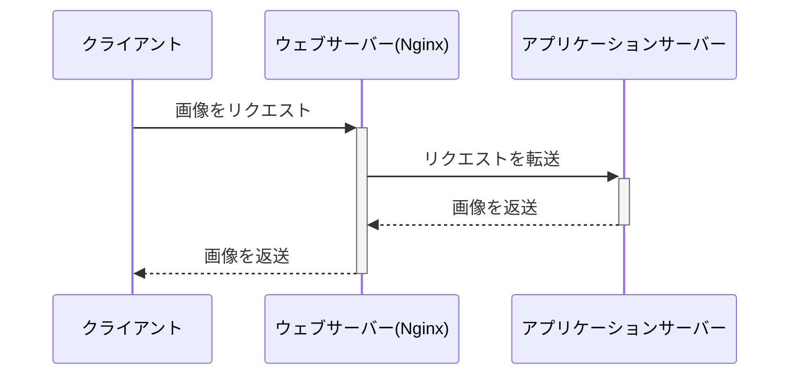
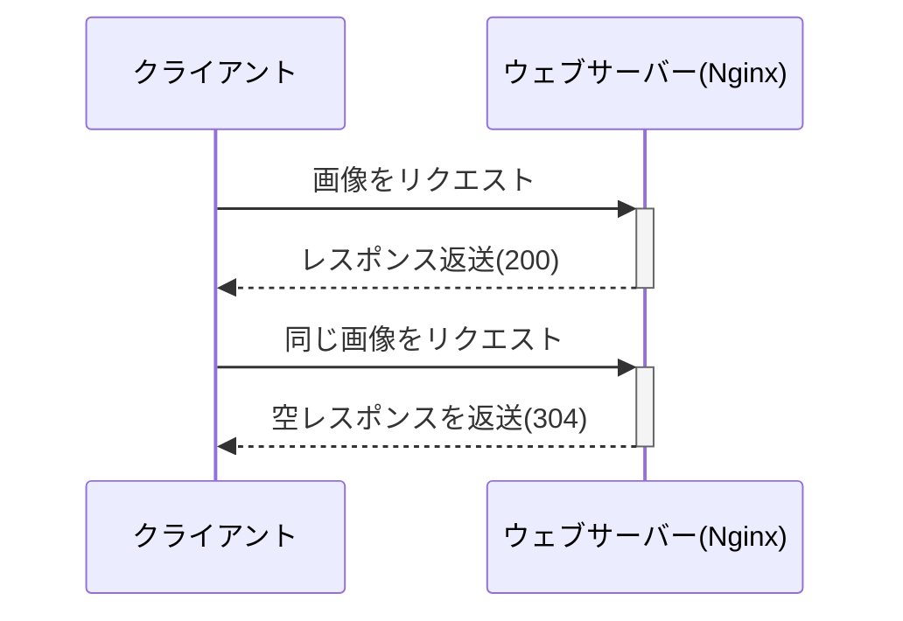

# private-isuでのチューニングの流れ

## 想定している状況

[private-isuで環境構築から最初のチューニングをするまで](./example/private-isuで環境構築から最初のチューニングをするまで.md)を参考に環境構築およびインデックスを貼るまでの作業が完了している状況を想定している。なお、Rubyを選択している。

```json
{"pass":true,"score":7952,"success":6787,"fail":0,"messages":[]}
```

## ISUCON本のチューニング

ISUCON本で紹介されているチューニングを順次行う。
[コードだけ見たい人はこちら](https://github.com/tatsujin-web-performance/tatsujin-web-performance/blob/main/appendix-A/README.md)

### CPU使用率がなぜか一定の値で頭打ちになってしまっている

(状況)

- htopで使用率をみると50~60%程度しか使われていなかった
- htopのCPU%でみると、アプリケーションサーバー50%、MySQLが40%程度

ISUCONのベンチマークは限界までリクエストを飛ばしてくるので、CPU使用率は100%に張り付くのが普通なため、何らかの問題があると考えられる。

(修正内容)

CPUが2コアなのに、プロセス数が1で固定されてしまっているため、プロセス数を4個に増やした。

```shell
# webapp/ruby/unicorn_config.rb
worker_processes 4
```

結果として、8000点→12000点に上がった。

```json
{"pass":true,"score":12858,"success":11645,"fail":0,"messages":[]}
```

### 静的ファイルを返すのが遅い

(状況)
alpでみると`/favicon.ico`が遅いエンドポイントとして出てきていた。

```shell
+-------+-----+------+-----+-----+-----+--------+---------------------+-------+-------+---------+-------+-------+-------+-------+--------+-----------+-------------+----------------+------------+
| COUNT | 1XX | 2XX  | 3XX | 4XX | 5XX | METHOD |         URI         |  MIN  |  MAX  |   SUM   |  AVG  |  P90  |  P95  |  P99  | STDDEV | MIN(BODY) |  MAX(BODY)  |   SUM(BODY)    | AVG(BODY)  |
+-------+-----+------+-----+-----+-----+--------+---------------------+-------+-------+---------+-------+-------+-------+-------+--------+-----------+-------------+----------------+------------+
| 6816  | 0   | 6816 | 0   | 0   | 0   | GET    | /image/[a-zA-Z0-9]+ | 0.001 | 0.293 | 256.942 | 0.038 | 0.082 | 0.120 | 0.180 | 0.036  | 39440.000 | 1056749.000 | 2132841721.000 | 312916.919 |
| 621   | 0   | 621  | 0   | 0   | 0   | GET    | /                   | 0.074 | 0.741 | 170.216 | 0.274 | 0.318 | 0.361 | 0.455 | 0.054  | 2320.000  | 5049.000    | 1736988.000    | 2797.082   |
| 101   | 0   | 101  | 0   | 0   | 0   | GET    | /posts              | 0.197 | 0.424 | 29.497  | 0.292 | 0.344 | 0.363 | 0.397 | 0.041  | 4211.000  | 4896.000    | 455464.000     | 4509.545   |
| 465   | 0   | 0    | 465 | 0   | 0   | POST   | /login              | 0.003 | 0.265 | 27.593  | 0.059 | 0.106 | 0.145 | 0.203 | 0.038  | 0.000     | 0.000       | 0.000          | 0.000      |
| 618   | 0   | 618  | 0   | 0   | 0   | GET    | /favicon.ico        | 0.000 | 0.453 | 26.688  | 0.043 | 0.100 | 0.134 | 0.220 | 0.046  | 43.000    | 43.000      | 26574.000      | 43.000     |
```

(修正内容)

元々静的ファイルはアプリケーションサーバーを経由して取得していたが、ウェブサーバーで返すように変更した。

修正前



修正後



具体的にはNginxの設定ファイルに下記のような設定を追加した。

```conf
server {
  # 関係ない部分は省略
  location ~ ^/(favicon\.ico|css/|js/|img/) {
    root /home/isucon/private_isu/webapp/public/;
    expires 1d;
  }
}
```

`expires 1d;`を設定すると、ブラウザがキャッシュするようになるため、304(Not Modified)を返すことでレスポンスを返すのを省略できる。

結果として、12000点→14000点に上がった。

```json
{"pass":true,"score":14803,"success":13644,"fail":0,"messages":[]}
```

また、レスポンスが遅いエンドポイントに`favicon.ico`が出なくなった。

```shell
+-------+-----+------+-----+-----+-----+--------+---------------------+-------+-------+---------+-------+-------+-------+-------+--------+-----------+-------------+----------------+------------+
| COUNT | 1XX | 2XX  | 3XX | 4XX | 5XX | METHOD |         URI         |  MIN  |  MAX  |   SUM   |  AVG  |  P90  |  P95  |  P99  | STDDEV | MIN(BODY) |  MAX(BODY)  |   SUM(BODY)    | AVG(BODY)  |
+-------+-----+------+-----+-----+-----+--------+---------------------+-------+-------+---------+-------+-------+-------+-------+--------+-----------+-------------+----------------+------------+
| 7253  | 0   | 7253 | 0   | 0   | 0   | GET    | /image/[a-zA-Z0-9]+ | 0.005 | 0.388 | 323.031 | 0.045 | 0.094 | 0.133 | 0.209 | 0.040  | 38595.000 | 1086666.000 | 2067907651.000 | 285110.665 |
| 594   | 0   | 594  | 0   | 0   | 0   | GET    | /                   | 0.077 | 0.736 | 168.050 | 0.283 | 0.336 | 0.376 | 0.527 | 0.059  | 2294.000  | 5048.000    | 1689603.000    | 2844.449   |
| 828   | 0   | 828  | 0   | 0   | 0   | GET    | /posts/[0-9]+       | 0.002 | 0.286 | 44.513  | 0.054 | 0.113 | 0.149 | 0.227 | 0.043  | 681.000   | 1856.000    | 979081.000     | 1182.465   |
| 443   | 0   | 0    | 443 | 0   | 0   | POST   | /login              | 0.001 | 0.391 | 29.816  | 0.067 | 0.114 | 0.156 | 0.249 | 0.045  | 0.000     | 0.000       | 0.000          | 0.000      |
| 95    | 0   | 95   | 0   | 0   | 0   | GET    | /posts              | 0.081 | 0.534 | 29.156  | 0.307 | 0.376 | 0.429 | 0.534 | 0.070  | 4248.000  | 4878.000    | 429232.000     | 4518.232   |
```

### 画像を返すのが遅い

(状況)
alpでみると`/image/[a-zA-Z0-9]+`が遅いエンドポイントとして出てきている。これは画像をDBにバイナリで保存しており、アプリケーションサーバーを経由して取得しているためである。

(修正内容)
アクセスがあった画像と新しく投稿される画像は静的ファイルとして保存するようにし、アプリケーションサーバーを経由せずにウェブサーバーから返すように変更した。

Nginxの設定

```conf
server {
  # 関係ない部分は省略
  location /image/ {
    root /home/isucon/private_isu/webapp/public/; # 画像を保存しているディレクトリ
    expires 1d; # ブラウザでキャッシュされるようにする
    try_files $uri @app; # ファイルが存在しない場合は、アプリケーションサーバーにリクエストを転送する
  }

  location @app {
    internal; # これをつけると、このロケーションは内部リダクイレクト専用という意味になる
    proxy_pass http://localhost:8080;
  }
}
```

コードについては割愛([参考](https://github.com/tatsujin-web-performance/tatsujin-web-performance/commit/907c70b3f7e722068fd3462445d8cee8efb27a76#diff-1b20ce28a2936572d560eeec0b6548dd5476509e6b99aaa9e04518ac658947a9R326))

結果として、14000点→19000点に上がった。

```json
{"pass":true,"score":19772,"success":19073,"fail":0,"messages":[]}
```

また、alpのログをみると、`/image/[a-zA-Z0-9]+`が最上位ではなくなった。

```shell
+-------+-----+-----+-------+-----+-----+--------+---------------------+-------+-------+---------+-------+-------+-------+-------+--------+-----------+-------------+--------------+-----------+
| COUNT | 1XX | 2XX |  3XX  | 4XX | 5XX | METHOD |         URI         |  MIN  |  MAX  |   SUM   |  AVG  |  P90  |  P95  |  P99  | STDDEV | MIN(BODY) |  MAX(BODY)  |  SUM(BODY)   | AVG(BODY) |
+-------+-----+-----+-------+-----+-----+--------+---------------------+-------+-------+---------+-------+-------+-------+-------+--------+-----------+-------------+--------------+-----------+
| 642   | 0   | 642 | 0     | 0   | 0   | GET    | /                   | 0.075 | 0.849 | 264.025 | 0.411 | 0.518 | 0.546 | 0.642 | 0.091  | 2437.000  | 5049.000    | 2077937.000  | 3236.662  |
| 260   | 0   | 260 | 0     | 0   | 0   | GET    | /posts              | 0.070 | 0.641 | 109.485 | 0.421 | 0.517 | 0.548 | 0.595 | 0.088  | 4216.000  | 4928.000    | 1177669.000  | 4529.496  |
| 14474 | 0   | 638 | 13836 | 0   | 0   | GET    | /image/[a-zA-Z0-9]+ | 0.000 | 0.395 | 76.960  | 0.005 | 0.000 | 0.000 | 0.241 | 0.035  | 0.000     | 1086666.000 | 92817008.000 | 6412.672  |
| 345   | 0   | 0   | 345   | 0   | 0   | POST   | /login              | 0.001 | 0.410 | 64.878  | 0.188 | 0.286 | 0.311 | 0.353 | 0.078  | 0.000     | 0.000       | 0.000        | 0.000     |
| 278   | 0   | 278 | 0     | 0   | 0   | GET    | /posts/[0-9]+       | 0.002 | 0.425 | 52.039  | 0.187 | 0.288 | 0.307 | 0.396 | 0.083  | 689.000   | 1647.000    | 325252.000   | 1169.971  |
```

### `GET /`が遅い

(状況)
先ほどのalpのログをみると`/`が遅いエンドポイントとして出てきている。

estackprofでのCPU使用率と合わせてコードを見ていく。

```shell
                                  |   231  |     get '/' do
    4    (0.0%)                   |   232  |       me = get_session_user()
                                  |   233  | 
  314    (0.5%)                   |   234  |       results = db.query('SELECT `id`, `user_id`, `body`, `created_at`, `mime` FROM `posts` ORDER BY `created_at` DESC')
 44046   (66.4%)                  |   235  |       posts = make_posts(results)
                                  |   236  | 
  902    (1.4%) /     1   (0.0%)  |   237  |       erb :index, layout: :layout, locals: { posts: posts, me: me }
    1    (0.0%) /     1   (0.0%)  |   238  |     end
```

```shell
                                  |   108  |       def make_posts(results, all_comments: false)
                                  |   109  |         posts = []
 46682   (70.3%) /     7   (0.0%) |   110  |         results.to_a.each do |post|
 1007    (1.5%) /    40   (0.1%)  |   111  |           post[:comment_count] = db.prepare('SELECT COUNT(*) AS `count` FROM `comments` WHERE `post_id` = ?').execute(
    3    (0.0%) /     3   (0.0%)  |   112  |             post[:id]
   39    (0.1%) /     5   (0.0%)  |   113  |           ).first[:count]
                                  |   114  | 
    6    (0.0%) /     6   (0.0%)  |   115  |           query = 'SELECT * FROM `comments` WHERE `post_id` = ? ORDER BY `created_at` DESC'
    2    (0.0%) /     2   (0.0%)  |   116  |           unless all_comments
   15    (0.0%) /    15   (0.0%)  |   117  |             query += ' LIMIT 3'
                                  |   118  |           end
 1171    (1.8%) /    29   (0.0%)  |   119  |           comments = db.prepare(query).execute(
    5    (0.0%) /     5   (0.0%)  |   120  |             post[:id]
   25    (0.0%) /     4   (0.0%)  |   121  |           ).to_a
 1988    (3.0%) /     8   (0.0%)  |   122  |           comments.each do |comment|
 1912    (2.9%) /    58   (0.1%)  |   123  |             comment[:user] = db.prepare('SELECT * FROM `users` WHERE `id` = ?').execute(
    8    (0.0%) /     8   (0.0%)  |   124  |               comment[:user_id]
   47    (0.1%) /     4   (0.0%)  |   125  |             ).first
    3    (0.0%) /     3   (0.0%)  |   126  |           end
   12    (0.0%) /     5   (0.0%)  |   127  |           post[:comments] = comments.reverse
                                  |   128  | 
 1236    (1.9%) /    34   (0.1%)  |   129  |           post[:user] = db.prepare('SELECT * FROM `users` WHERE `id` = ?').execute(
    1    (0.0%) /     1   (0.0%)  |   130  |             post[:user_id]
   27    (0.0%) /     1   (0.0%)  |   131  |           ).first
                                  |   132  | 
   12    (0.0%) /    11   (0.0%)  |   133  |           posts.push(post) if post[:user][:del_flg] == 0
    7    (0.0%) /     7   (0.0%)  |   134  |           break if posts.length >= POSTS_PER_PAGE
    3    (0.0%) /     3   (0.0%)  |   135  |         end
                                  |   136  | 
                                  |   137  |         posts
    1    (0.0%) /     1   (0.0%)  |   138  |       end
```

また、このときのスロークエリログの上位は、以下のようになっている。

```shell
Count: 260  Time=0.08s (19s)  Lock=0.00s (0s)  Rows=9895.5 (2572820), isuconp[isuconp]@localhost
  SELECT `id`, `user_id`, `body`, `mime`, `created_at` FROM `posts` WHERE `created_at` <= 'S' ORDER BY `created_at` DESC

Count: 67  Time=0.07s (4s)  Lock=0.00s (0s)  Rows=1.0 (67), isuconp[isuconp]@localhost
  SELECT COUNT(*) AS count FROM `comments` WHERE `user_id` = N

Count: 642  Time=0.06s (40s)  Lock=0.00s (0s)  Rows=10017.0 (6430938), isuconp[isuconp]@localhost
  SELECT `id`, `user_id`, `body`, `created_at`, `mime` FROM `posts` ORDER BY `created_at` DESC

Count: 67  Time=0.02s (1s)  Lock=0.00s (0s)  Rows=9.6 (645), isuconp[isuconp]@localhost
  SELECT `id`, `user_id`, `body`, `mime`, `created_at` FROM `posts` WHERE `user_id` = N ORDER BY `created_at` DESC
```

このコードの問題点は下記の通りである。

- LIMITがなく、一旦投稿を全て取得している
- その投稿をさらに1個ずつ取得して、それをbreakするまで20回繰り返している
- ループのたびにユーザー情報を取得している

(修正内容)
JOINを使ってユーザー情報を取得しつつ、LIMITを使うように変更した。

```sql
SELECT p.id, p.user_id, p.body, p.created_at, p.mime, u.account_name
FROM `posts` AS p JOIN `users` AS u ON (p.user_id=u.id)
WHERE u.del_flg=0
ORDER BY p.created_at DESC
LIMIT 20
```

ただし、これだけだとソートが実行されてしまうため、インデックスを貼る必要があった。

```sql
-- Using filesortとなっており、インデックスは効いておらず、9000行以上のデータをソートしている
mysql> EXPLAIN SELECT p.id, p.user_id, p.body, p.created_at, p.mime, u.account_name  FROM `posts` AS p JOIN `users` AS u ON (p.user_i
d=u.id)  WHERE u.del_flg=0  ORDER BY p.created_at DESC LIMIT 20;
+----+-------------+-------+------------+--------+---------------+---------+---------+-------------------+------+----------+----------------+
| id | select_type | table | partitions | type   | possible_keys | key     | key_len | ref               | rows | filtered | Extra          |
+----+-------------+-------+------------+--------+---------------+---------+---------+-------------------+------+----------+----------------+
|  1 | SIMPLE      | p     | NULL       | ALL    | NULL          | NULL    | NULL    | NULL              | 9672 |   100.00 | Using filesort |
|  1 | SIMPLE      | u     | NULL       | eq_ref | PRIMARY       | PRIMARY | 4       | isuconp.p.user_id |    1 |    10.00 | Using where    |
+----+-------------+-------+------------+--------+---------------+---------+---------+-------------------+------+----------+----------------+

-- (参考)EXPLAIN FORMAT=TREEの場合は下記の通り
+---------------------------------------------------------------------------------------------------------------------------------------------------------------------------------------------------------------------------------------------------------------------------------------------------------------------------------------------------------------------------+
| EXPLAIN                                                                                                                                                                                                                                                                                                                                                                   |
+---------------------------------------------------------------------------------------------------------------------------------------------------------------------------------------------------------------------------------------------------------------------------------------------------------------------------------------------------------------------------+
| -> Limit: 20 row(s)  (cost=88549 rows=20)
    -> Nested loop inner join  (cost=88549 rows=967)
        -> Sort: p.created_at DESC  (cost=81258 rows=9672)
            -> Table scan on p  (cost=81258 rows=9672)
        -> Filter: (u.del_flg = 0)  (cost=0.654 rows=0.1)
            -> Single-row index lookup on u using PRIMARY (id=p.user_id)  (cost=0.654 rows=1)
 |
+---------------------------------------------------------------------------------------------------------------------------------------------------------------------------------------------------------------------------------------------------------------------------------------------------------------------------------------------------------------------------+
```

ソートはcreated_atに対して行われているため、created_atにインデックスを貼った。

```sql
mysql> ALTER TABLE posts ADD INDEX posts_order_idx (created_at DESC);
```

結果として、19000点→80000点に上がった。

```json
{"pass":true,"score":80110,"success":77483,"fail":0,"messages":[]}
```

alpのログをみると、あいかわらず`/`が最上位ではあるが、平均レスポンスタイムが大幅に改善されている。(0.411秒→0.081秒)

```shell
+-------+-----+------+-------+-----+-----+--------+---------------------+-------+-------+---------+-------+-------+-------+-------+--------+-----------+-------------+---------------+-----------+
| COUNT | 1XX | 2XX  |  3XX  | 4XX | 5XX | METHOD |         URI         |  MIN  |  MAX  |   SUM   |  AVG  |  P90  |  P95  |  P99  | STDDEV | MIN(BODY) |  MAX(BODY)  |   SUM(BODY)   | AVG(BODY) |
+-------+-----+------+-------+-----+-----+--------+---------------------+-------+-------+---------+-------+-------+-------+-------+--------+-----------+-------------+---------------+-----------+
| 2568  | 0   | 2568 | 0     | 0   | 0   | GET    | /                   | 0.020 | 0.244 | 208.233 | 0.081 | 0.107 | 0.118 | 0.145 | 0.021  | 2216.000  | 5047.000    | 6567099.000   | 2557.282  |
| 900   | 0   | 900  | 0     | 0   | 0   | GET    | /posts              | 0.052 | 0.237 | 102.402 | 0.114 | 0.137 | 0.145 | 0.165 | 0.019  | 4211.000  | 4952.000    | 4093288.000   | 4548.098  |
| 1216  | 0   | 0    | 1216  | 0   | 0   | POST   | /login              | 0.001 | 0.187 | 84.542  | 0.070 | 0.095 | 0.104 | 0.126 | 0.021  | 0.000     | 0.000       | 0.000         | 0.000     |
| 56773 | 0   | 1653 | 55120 | 0   | 0   | GET    | /image/[a-zA-Z0-9]+ | 0.000 | 0.129 | 59.085  | 0.001 | 0.000 | 0.000 | 0.051 | 0.008  | 56433.000 | 1155222.000 | 246572759.000 | 4343.134  |
```

また、スロークエリログをみると、合計で40秒かかっていた下記のクエリが消えていた。

```shell
# 元々問題になっていたスロークエリログ
Count: 642  Time=0.06s (40s)  Lock=0.00s (0s)  Rows=10017.0 (6430938), isuconp[isuconp]@localhost
  SELECT `id`, `user_id`, `body`, `created_at`, `mime` FROM `posts` ORDER BY `created_at` DESC
```

```shell
# 修正後のスロークエリログ
Count: 210  Time=0.07s (13s)  Lock=0.00s (0s)  Rows=1.0 (210), isuconp[isuconp]@localhost
  SELECT COUNT(*) AS count FROM `comments` WHERE `user_id` = N

Count: 210  Time=0.04s (8s)  Lock=0.00s (0s)  Rows=10.0 (2110), isuconp[isuconp]@localhost
  SELECT p.`id`, p.`user_id`, p.`body`, p.`mime`, p.`created_at`, u.`account_name`
  FROM `posts` p JOIN `users` u ON (p.user_id=u.id)
  WHERE `user_id` = N AND u.del_flg=N
  ORDER BY p.`created_at` DESC LIMIT N

Count: 210  Time=0.01s (1s)  Lock=0.00s (0s)  Rows=10.1 (2111), isuconp[isuconp]@localhost
  SELECT `id` FROM `posts` WHERE `user_id` = N
```

### ADMIN PREPAREに時間がかかっている

(状況)

スロークエリログをみると、大量に呼ばれている下記のクエリがある。

```shell
Count: 233449  Time=0.00s (0s)  Lock=0.00s (0s)  Rows=0.0 (0), 0users@0hosts
  administrator command: Prepare

Count: 232695  Time=0.00s (0s)  Lock=0.00s (0s)  Rows=0.0 (0), 0users@0hosts
  administrator command: Close stmt
```

これは、サーバーサイドプリペアドステートメントに使用されるクエリである。
([プリペアドステートメントについてはこちら](https://dev.mysql.com/doc/refman/8.0/ja/sql-prepared-statements.html))

これは一見すると問題なさそうだが、pt-query-digestでみると、このクエリに時間がかかっていることがわかる。どうやらスロークエリログだと、一回のクエリにかかる時間が短すぎて切り捨てられてしまうようである。

```shell
# Profile
# Rank Query ID                           Response time Calls R/Call V/M
# ==== ================================== ============= ===== ====== =====
#    1 0xDA556F9115773A1A99AA0165670CE848  3.5967 24.1% 44044 0.0001  0.00 ADMIN PREPARE
#    2 0xCDEB1AFF2AE2BE51B2ED5CF03D4E749F  2.2861 15.3%    36 0.0635  0.00 SELECT comments
#    3 0x624863D30DAC59FA16849282195BE09F  2.2841 15.3% 12643 0.0002  0.00 SELECT comments
```

(修正内容)
サーバーサイドプリペアドステートメントをせずにクライアントサイドプリペアドステートメントを使うようにする。具体的には、DB.prepare+executeで実行していたクエリをDB.xqueryに変更した。

結果として、スコアが80000点→85000点に上がった。

```json
{"pass":true,"score":85555,"success":82985,"fail":0,"messages":[]}
```

また、pt-query-digestのスロークエリから、ADMIN PREPAREがなくなった。

```shell
# Profile
# Rank Query ID                           Response time Calls R/Call V/M
# ==== ================================== ============= ===== ====== =====
#    1 0x396201721CD58410E070DA9421CA8C8D  3.9256 32.5% 20844 0.0002  0.00 SELECT users
#    2 0x624863D30DAC59FA16849282195BE09F  2.3631 19.5%  8736 0.0003  0.00 SELECT comments
#    3 0xCDEB1AFF2AE2BE51B2ED5CF03D4E749F  1.9960 16.5%    31 0.0644  0.00 SELECT comments
```

### インデックスが貼ってなさそうなスロークエリがある

スロークエリの上位に下記のクエリがある。

```shell
(状況)
Count: 706  Time=0.07s (46s)  Lock=0.00s (0s)  Rows=1.0 (706), isuconp[isuconp]@localhost
  SELECT COUNT(*) AS count FROM `comments` WHERE `user_id` = 'S'
```

EXPLAINをみると、インデックスが貼られていないことがわかる。

```shell
mysql> EXPLAIN SELECT COUNT(*) AS count FROM `comments` WHERE `user_id` = '77';
+----+-------------+----------+------------+------+---------------+------+---------+------+-------+----------+-------------+
| id | select_type | table    | partitions | type | possible_keys | key  | key_len | ref  | rows  | filtered | Extra       |
+----+-------------+----------+------------+------+---------------+------+---------+------+-------+----------+-------------+
|  1 | SIMPLE      | comments | NULL       | ALL  | NULL          | NULL | NULL    | NULL | 99666 |    10.00 | Using where |
+----+-------------+----------+------------+------+---------------+------+---------+------+-------+----------+-------------+
```

(修正内容)
`user_id`にインデックスを貼った。

```sql
ALTER TABLE `comments` ADD INDEX `idx_user_id` (`user_id`);
```

EXPLAINをみると、インデックスが効いていることがわかる。

```shell
mysql> EXPLAIN SELECT COUNT(*) AS count FROM `comments` WHERE `user_id` = '77';
+----+-------------+----------+------------+------+---------------+-------------+---------+-------+------+----------+-------------+
| id | select_type | table    | partitions | type | possible_keys | key         | key_len | ref   | rows | filtered | Extra       |
+----+-------------+----------+------------+------+---------------+-------------+---------+-------+------+----------+-------------+
|  1 | SIMPLE      | comments | NULL       | ref  | idx_user_id   | idx_user_id | 4       | const |  101 |   100.00 | Using index |
+----+-------------+----------+------------+------+---------------+-------------+---------+-------+------+----------+-------------+
1 row in set, 1 warning (0.01 sec)
```

スコアとしては、85000点から88000点に上がった。

```json
{"pass":true,"score":88215,"success":85491,"fail":0,"messages":[]}
```

### make_postsにN+1問題がある

(状況)
make_postsはestackprofでみると、いまだに実行されている時間が長いことが分かる。
内部で実行されているクエリがループのたびに実行されているのが問題である。

```ruby
                                  |   106  |       def make_posts(results, all_comments: false)
                                  |   107  |         posts = []
 11563   (51.8%) /    12   (0.1%) |   108  |         results.to_a.each do |post|
 2959   (13.2%) /   112   (0.5%)  |   109  |           post[:comment_count] = db.xquery('SELECT COUNT(*) AS `count` FROM `comments` WHERE `post_id` = ?', post[:id]).first[:count]
                                  |   110  |
   15    (0.1%) /    15   (0.1%)  |   111  |           query = 'SELECT * FROM `comments` WHERE `post_id` = ? ORDER BY `created_at` DESC'
    7    (0.0%) /     7   (0.0%)  |   112  |           unless all_comments
   44    (0.2%) /    44   (0.2%)  |   113  |             query += ' LIMIT 3'
                                  |   114  |           end
 3421   (15.3%) /    73   (0.3%)  |   115  |           comments = db.xquery(query, post[:id]).to_a
 4727   (21.2%) /    14   (0.1%)  |   116  |           comments.each do |comment|
 4653   (20.8%) /   149   (0.7%)  |   117  |             comment[:user] = db.xquery('SELECT * FROM `users` WHERE `id` = ?', comment[:user_id]).first
    4    (0.0%) /     4   (0.0%)  |   118  |           end
   45    (0.2%) /    31   (0.1%)  |   119  |           post[:comments] = comments.reverse
                                  |   120  |
   96    (0.4%) /    96   (0.4%)  |   121  |           post[:user] = {
   12    (0.1%) /    12   (0.1%)  |   122  |             account_name: post[:account_name],
                                  |   123  |           }
                                  |   124  |
   35    (0.2%) /    13   (0.1%)  |   125  |           posts.push(post)
    5    (0.0%) /     5   (0.0%)  |   126  |         end
                                  |   127  |
                                  |   128  |         posts
                                  |   129  |       end
                                  |   130  |
```

(修正内容)
memcachedでコメントとコメント数をキャッシュする。memcachedはprivate-isu上では既に動いているのでそれを使った。

- コメントとコメント数を取得する前にmemcachedを確認するように改修
  - データがあればそちらを使う
  - なければDBクエリを発行する

コメント数の実装例

```ruby
# 元々の実装
post[:comment_count] = db.xquery('SELECT COUNT(*) AS `count` FROM `comments` WHERE `post_id` = ?', post[:id]).first[:count]

# 改修後
cached_comments_count = memcached.get("comments.#{post[:id]}.count")
if cached_comments_count
  # キャッシュが存在したらそれを使う
  post[:comment_count] = cached_comments_count.to_i
else
  # 存在しなかったらMySQLにクエリ
  post[:comment_count] = db.xquery('SELECT COUNT(*) AS `count` FROM `comments` WHERE `post_id` = ?', post[:id]).first[:count]
  # memcachedにset(TTL 10s)
  memcached.set("comments.#{post[:id]}.count", post[:comment_count], 10)
end
```

上記の修正だけでもスコアが88000点→94000点に上がった。

```json
{"pass":true,"score":94192,"success":91286,"fail":0,"messages":[]}
```

なお、コメントが追加されたら、キャッシュを破棄するようにしないと整合性が取れなくなる。
しかし、実際にはそういった実装をしなくてもTTL10秒にするだけでベンチマークが通るので、この件はある程度の遅延が認められていると考えられる。

コメントについてもキャッシュするようにすると、スコアは94000点から140000点に上がった。

```json
{"pass":true,"score":142113,"success":138151,"fail":0,"messages":[]}
```

### スロークエリが残っている

(状況)
スロークエリログをみると、以下のクエリがいまだに遅い。

```shell
Count: 1612  Time=0.04s (67s)  Lock=0.00s (0s)  Rows=10.1 (16239), isuconp[isuconp]@localhost
  SELECT p.`id`, p.`user_id`, p.`body`, p.`mime`, p.`created_at`, u.`account_name`
  FROM `posts` p JOIN `users` u ON (p.user_id=u.id)
  WHERE `user_id` = 'S' AND u.del_flg=N
  ORDER BY p.`created_at` DESC LIMIT N

Count: 2  Time=0.01s (0s)  Lock=0.00s (0s)  Rows=0.0 (0), root[root]@localhost
  SET GLOBAL slow_query_log_file = @cur_slow_query_log_file

Count: 1613  Time=0.01s (13s)  Lock=0.00s (0s)  Rows=10.1 (16249), isuconp[isuconp]@localhost
  SELECT `id` FROM `posts` WHERE `user_id` = 'S'

Count: 1139  Time=0.01s (7s)  Lock=0.00s (0s)  Rows=1.0 (1139), isuconp[isuconp]@localhost
  SELECT * FROM `posts` WHERE `id` = 'S'
```

EXPLAINをみると、possible_keysがNULLになっているため、有効なインデックスがないことが分かる。

```sql
mysql> EXPLAIN SELECT p.`id`, p.`user_id`, p.`body`, p.`mime`, p.`created_at`, u.`account_name`
    ->         FROM `posts` p JOIN `users` u ON (p.user_id=u.id)
    ->         WHERE `user_id` = '385' AND u.del_flg=0
    ->         ORDER BY p.`created_at` DESC LIMIT 20;
+----+-------------+-------+------------+-------+---------------+-----------------+---------+-------+------+----------+-------------+
| id | select_type | table | partitions | type  | possible_keys | key             | key_len | ref   | rows | filtered | Extra       |
+----+-------------+-------+------------+-------+---------------+-----------------+---------+-------+------+----------+-------------+
|  1 | SIMPLE      | u     | NULL       | const | PRIMARY       | PRIMARY         | 4       | const |    1 |   100.00 | NULL        |
|  1 | SIMPLE      | p     | NULL       | index | NULL          | posts_order_idx | 4       | NULL  |   20 |     1.00 | Using where |
+----+-------------+-------+------------+-------+---------------+-----------------+---------+-------+------+----------+-------------+
2 rows in set, 1 warning (0.00 sec)

mysql> EXPLAIN FORMAT=TREE SELECT p.`id`, p.`user_id`, p.`body`, p.`mime`, p.`created_at`, u.`account_name`         FROM `posts` p JOIN `use
rs` u ON (p.user_id=u.id)         WHERE `user_id` = '385' AND u.del_flg=0         ORDER BY p.`created_at` DESC LIMIT 20;
+------------------------------------------------------------------------------------------------------------------------------------------------------------------------------------------------+
| EXPLAIN                                                                                                                                                                                        |
+------------------------------------------------------------------------------------------------------------------------------------------------------------------------------------------------+
| -> Limit: 20 row(s)  (cost=168 rows=0.2)
    -> Filter: ((p.user_id = '385') and (p.user_id = 385))  (cost=168 rows=0.2)
        -> Index scan on p using posts_order_idx  (cost=168 rows=20)
 |
+------------------------------------------------------------------------------------------------------------------------------------------------------------------------------------------------+
1 row in set (0.00 sec)
```

(修正内容)

postsにuser_idとcreated_atの複合インデックスを貼った。

```sql
mysql> ALTER TABLE `posts` ADD INDEX `posts_user_idx` (`user_id`,`created_at` DESC);
```

ただし、これだけだとpostsテーブルに複数のインデックスが貼られ、実行計画時にどのインデックスを使われるかが不安定になるため、スコアが下がった。

```json
{"pass":true,"score":30257,"success":29275,"fail":0,"messages":[]}
```

pt-query-digestで個別に遅くなったクエリが分かるので、それに対してEXPLAINを実行すると、下記のようになった。

```sql
mysql> EXPLAIN SELECT p.id, p.user_id, p.body, p.created_at, p.mime, u.account_name
    ->         FROM `posts` AS p JOIN `users` AS u ON (p.user_id=u.id)
    ->         WHERE u.del_flg=0
    ->         ORDER BY p.created_at DESC
    ->         LIMIT 20;
+----+-------------+-------+------------+------+----------------+----------------+---------+--------------+------+----------+----------------------------------------------+
| id | select_type | table | partitions | type | possible_keys  | key            | key_len | ref          | rows | filtered | Extra                                        |
+----+-------------+-------+------------+------+----------------+----------------+---------+--------------+------+----------+----------------------------------------------+
|  1 | SIMPLE      | u     | NULL       | ALL  | PRIMARY        | NULL           | NULL    | NULL         | 1060 |    10.00 | Using where; Using temporary; Using filesort |
|  1 | SIMPLE      | p     | NULL       | ref  | posts_user_idx | posts_user_idx | 4       | isuconp.u.id |    9 |   100.00 | NULL                                         |
+----+-------------+-------+------------+------+----------------+----------------+---------+--------------+------+----------+----------------------------------------------+

mysql> EXPLAIN FORMAT=TREE SELECT p.id, p.user_id, p.body, p.created_at, p.mime, u.account_name         FROM `posts` AS p JOIN `users` AS u ON
 (p.user_id=u.id)         WHERE u.del_flg=0         ORDER BY p.created_at DESC         LIMIT 20;
+------------------------------------------------------------------------------------------------------------------------------------------------------------------------------------------------------------------------------------------------------------------------------------------------------------------------------------------------------------------------------------------------------------------------------------+
| EXPLAIN                                                                                                                                                                                                                                                                                                                                                                                                                            |
+------------------------------------------------------------------------------------------------------------------------------------------------------------------------------------------------------------------------------------------------------------------------------------------------------------------------------------------------------------------------------------------------------------------------------------+
| -> Limit: 20 row(s)
    -> Sort: p.created_at DESC, limit input to 20 row(s) per chunk
        -> Stream results  (cost=1483 rows=1230)
            -> Nested loop inner join  (cost=1483 rows=1230)
                -> Filter: (u.del_flg = 0)  (cost=131 rows=127)
                    -> Table scan on u  (cost=131 rows=1272)
                -> Index lookup on p using posts_user_idx (user_id=u.id)  (cost=9.67 rows=9.67)
 |
+------------------------------------------------------------------------------------------------------------------------------------------------------------------------------------------------------------------------------------------------------------------------------------------------------------------------------------------------------------------------------------------------------------------------------------+
1 row in set (0.00 sec)
```

先ほどと実行順序が変わったり、フルスキャンが実行されてしまったりしている。これはJOINの結合順が逆になってしまっているからである。STRAIGHT_JOINで結合順を指定することで、インデックスが効くようになった。

```sql
SELECT p.`id`, p.`user_id`, p.`body`, p.`mime`, p.`created_at`, u.`account_name`
FROM `posts` p STRAIGHT_JOIN `users` u ON (p.user_id=u.id)
WHERE p.`created_at` <= ? AND u.del_flg=0
ORDER BY p.`created_at` DESC
LIMIT 20
```

結果として、スコアが142000点→151000点に上がった。

```json
{"pass":true,"score":151017,"success":146843,"fail":0,"messages":[]}
```

### 外部コマンドの実行が遅い

(状況)

opensslコマンドのハッシュ化で外部コマンドを呼び出しており、これが遅い。

```ruby
def digest(src)
  `printf "%s" #{Shellwords.shellescape(src)} | openssl dgst -sha512 | sed 's/^.*= //'`.strip
end
```

(修正内容)

RubyのOpenSSLライブラリを使ってハッシュ化するように変更した。

```ruby
require 'openssl'

def digest(src)
  OpenSSL::Digest::SHA512.hexdigest(src)
end
```

結果として、スコアが151000点→201000点に上がった。

```json
{"pass":true,"score":201864,"success":194951,"fail":0,"messages":[]}
```

### キャッシュの取得がN+1問題のまま

(状況)

ループのたびにmemcachedからデータを取得しているため、N+1問題が発生している。

```ruby
# 元々のコード(コメント数の取得)
def make_posts(results, all_comments: false)
  posts = []
  results.to_a.each do |post|
    cached_comments_count = memcached.get("comments.#{post[:id]}.count")
    if cached_comments_count
      # キャッシュが存在したらそれを使う
      post[:comment_count] = cached_comments_count.to_i
    else
      # 存在しなかったらMySQLにクエリ
      post[:comment_count] = db.xquery('SELECT COUNT(*) AS `count` FROM `comments` WHERE `post_id` = ?', post[:id]).first[:count]
      # memcachedにset(TTL 10s)
      memcached.set("comments.#{post[:id]}.count", post[:comment_count], 10)
    end
    #...
```

(修正内容)

一度に複数のキャッシュを取得するget_multiを使うように変更した。

```ruby
# 改修後
def make_posts(results, all_comments: false)
  posts = []
  # posts.idをあらかじめ取り出してキャッシュのキーを一覧にする
  count_keys = results.to_a.map{|post| "comments.#{post[:id]}.count"}
  comments_keys = results.to_a.map{|post| "comments.#{post[:id]}.#{all_comments.to_s}"}

  # get_multiで複数のキーを一度に取得する
  cached_counts = memcached.get_multi(count_keys)
  cached_comments = memcached.get_multi(comments_keys)

  results.to_a.each do |post|
    if cached_counts["comments.#{post[:id]}.count"]
      # 取得済みのキャッシュがあればそれを使う
      post[:comment_count] = cached_counts["comments.#{post[:id]}.count"].to_i
    else
      # 存在しなかったらMySQLにクエリ
      post[:comment_count] = db.xquery('SELECT COUNT(*) AS `count` FROM `comments` WHERE `post_id` = ?',
        post[:id]
      ).first[:count]
      # memcachedにset(TTL 10s)
      memcached.set("comments.#{post[:id]}.count", post[:comment_count], 10)
    end
    # ...
```

結果として、スコアが201000点→247000点に上がった。

```json
{"pass":true,"score":246990,"success":238246,"fail":0,"messages":[]}
```

### ログを全部止める

(状況)

ログが大量に出力されているため、パフォーマンスが低下している。特にスロークエリログは、本来ならば出さないようなクエリも出力するようにしているため、最終的には止める必要がある。

(修正内容)

ログを止めることでスコアが247000点→270000点に上がった。

```json
{"pass":true,"score":270740,"success":260741,"fail":0,"messages":[]}
```
